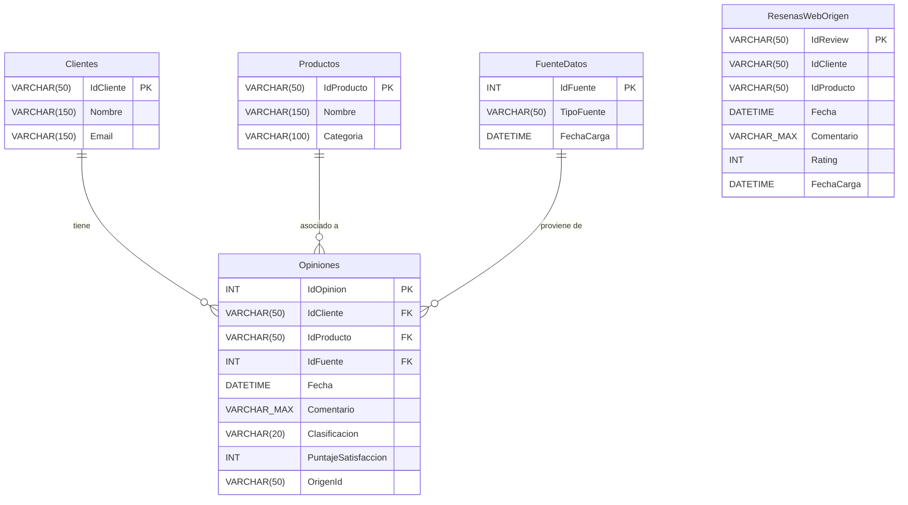

 Sistema de Análisis de Opiniones de Clientes

Contenido
1. Definición del Problema ............................................................................................. 3

2. Objetivos del Proyecto ............................................................................................... 3

3. Actividades del Proyecto ............................................................................................ 4

3.1 Modelado de la Base de Datos .............................................................................. 4

3.2 Desarrollo del Proceso ETL en .NET ....................................................................... 4

3.3 Implementación de Consultas y Reportes .............................................................. 5

3.4 Entregables Finales .............................................................................................. 5

4. Objetivos de Aprendizaje ........................................................................................... 5

5. Alcance .................................................................................................................... 6

6. Flujo del proceso de la solución ................................................................................. 6

7. Arquitectura de la solución ........................................................................................ 6

1. Definición del Problema

Una empresa de comercio electrónico desea analizar las opiniones que los clientes dejan
sobre sus productos en diferentes canales:

•  Archivos CSV: encuestas internas de satisfacción.

•  Base de datos relacional: reseñas publicadas en su sitio web.

•  API REST: comentarios en redes sociales.

Actualmente, la información está dispersa y es difícil integrarla para generar indicadores
de satisfacción y tendencias de opiniones.

El objetivo es desarrollar un sistema ETL en .NET que consolide, procese y analice estos
datos, permitiendo generar indicadores clave como:

•  Total de comentarios procesados.

•  Clasificación de opiniones (positivas, negativas, neutras).

•  Tendencia de satisfacción por producto.

•  Cantidad de reseñas por producto y porcentaje de satisfacción.

2. Objetivos del Proyecto

1.  Desarrollar un proceso ETL en .NET que:

o  Extraiga datos desde CSV, bases de datos relacionales y APIs externas.

o  Transforme los datos: limpieza, validación y clasificación (positiva, negativa
o neutra) usando análisis simple de palabras clave o librerías NLP básicas.

o  Cargue los datos consolidados y los resultados en una base de datos

analítica (PostgreSQL, SQLite o SQL Server).

2.  Identificar y modelar las tablas necesarias para almacenar los datos de todas las

fuentes.

3.  Crear un módulo de consultas y reportes que permita:

o  Listar opiniones por producto y rango de fechas.

o  Obtener la clasificación de opiniones por tipo (positiva, negativa, neutra).

o  Calcular porcentaje de satisfacción y número de comentarios por producto.

o  Mostrar tendencias de satisfacción a lo largo del tiempo.

3. Actividades del Proyecto

3.1 Modelado de la Base de Datos

•

Identificar tablas y relaciones considerando todas las fuentes de datos.

•  Definir llaves primarias y foráneas.

•  Crear la base de datos en SQL (PostgreSQL, SQLite o SQL Server).

3.2 Desarrollo del Proceso ETL en .NET

•  Extracción:

o  Leer CSV con encuestas.

o  Consultar la base de datos relacional para reseñas web.

o  Consumir API REST para obtener comentarios de redes sociales.

•  Transformación:

o  Limpieza de duplicados, caracteres especiales y comentarios vacíos.

o  Normalización de formatos (fechas, nombres de productos, IDs de clientes).

o  Clasificación de opiniones (positiva, negativa, neutra).

o  Cálculo de métricas básicas (cantidad de comentarios, porcentaje de

satisfacción).

•  Carga:

o

Insertar datos procesados en la base de datos analítica central.

3.3 Implementación de Consultas y Reportes

•  Queries SQL para obtener indicadores clave y métricas.

•  Generación de dashboard interactivo con Power BI Report Builder o ASP.NET Core

+ ChartJS.

•  Visualización de:

o  Total de comentarios procesados.

o  Clasificación de opiniones.

o  Tendencias de satisfacción por producto.

3.4 Entregables Finales

•  Worker Services en .NET para el proceso ETL.

•  Script SQL para creación de la base de datos y sus tablas.

•  Documentación breve del pipeline ETL (diagrama de flujo incluido).

•  Dashboard final mostrando indicadores clave de satisfacción y tendencias de

opiniones.

4. Objetivos de Aprendizaje

•

Implementar un proceso ETL completo en .NET con múltiples fuentes de datos.

•  Aplicar técnicas de limpieza, normalización y clasificación de datos.

•

Integrar resultados en una base de datos analítica centralizada.

•  Crear visualizaciones para interpretar y comunicar resultados de forma efectiva.

•

Introducir conceptos básicos de NLP en la clasificación de opiniones.

5. Alcance

Al finalizar el proyecto, los estudiantes deberán entregar:

1.  Código .NET documentado de todas las etapas del ETL.

2.  Script SQL para la creación de la base de datos analítica.

3.  Documentación breve del pipeline (con diagrama de flujo).

4.  Dashboard interactivo mostrando indicadores de satisfacción y tendencias de

opiniones.

6. Flujo del proceso de la solución

El proceso ETL se ejecuta de forma estructurada en tres etapas secuenciales:

### 6.1. Extracción (Extract)
Consiste en la lectura de los datos crudos desde tres fuentes heterogéneas simuladas localmente para garantizar reproducibilidad offline:
* **Encuestas Internas**: Archivo CSV ubicado en `Data/surveys_part1.csv` procesado de forma nativa mediante `CsvHelper`.
* **Reseñas Web (Base de Datos)**: Consulta relacional a la tabla `ResenasWebOrigen` en la base de datos `SistemaOpiniones` mediante el procedimiento almacenado `sp_ObtenerResenasWebOrigen`.
* **Comentarios en Redes Sociales (API REST)**: Solicitudes HTTP de tipo GET a la API local (`http://localhost:5000/api/social-comments`) para recuperar un conjunto de comentarios en formato JSON.

### 6.2. Transformación (Transform)
Modificación y acondicionamiento de los registros extraídos para cumplir con las reglas del almacén analítico:
* **Limpieza**: Eliminación de registros vacíos y descarte de nulos en comentarios.
* **Normalización de Identificadores (IDs)**: Conversión de formatos mixtos en CSV (p. ej., "C007", "P016") a valores numéricos enteros legibles ("7", "16") para mantener coherencia con las llaves de dimensiones.
* **Clasificación de Sentimientos (NLP Básico)**:
  * **Encuestas**: Mapeo directo y normalización de textos.
  * **Reseñas**: Traducción directa del Rating numérico (Rating >= 4 es "Positiva", 3 es "Neutra", <= 2 es "Negativa").
  * **API REST**: Clasificador por coincidencia de palabras clave que resta el conteo de términos negativos a los positivos para clasificar el sentimiento.
* **Validación Referencial**: Comprobación cruzada de existencia del `IdProducto` (el registro se descarta si no existe) y del `IdCliente` (se asigna NULL si el cliente no existe en la base analítica, permitiendo procesar opiniones anónimas de forma segura).

### 6.3. Carga (Load)
* **Dimensión Clientes y Productos**: Carga inicial mediante inserciones de tipo `INSERT IF NOT EXISTS` para asegurar que las llaves foráneas existan en el sistema.
* **Tabla de Hechos (Opiniones)**: Inserción de las opiniones procesadas. Se previene la duplicidad entre ejecuciones del pipeline a través del índice único filtrado `UQ_Opiniones_OrigenId_IdFuente` que asocia el ID original con el código de fuente.

```mermaid
flowchart TD
    subgraph Orígenes de Datos
        CSV[Data/surveys_part1.csv]
        DB_Orig[Tabla ResenasWebOrigen]
        API_REST[API REST: /api/social-comments]
    end

    subgraph Extracción (Extract)
        Ext_CSV[Extractor CSV]
        Ext_DB[SP sp_ObtenerResenasWebOrigen]
        Ext_API[SocialCommentsApiExtractor]
    end

    subgraph Transformación (Transform)
        Clean[Limpieza de textos y nulos]
        Normal[Normalización de IDs: C007 -> 7, P016 -> 16]
        Sent[Clasificación de Sentimiento: Palabras clave / Rating]
        FK_Val[Validación de Integridad Referencial: Clientes y Productos]
    end

    subgraph Carga (Load)
        Load_Dim[Cargar Clientes y Productos]
        Check_Dup[Validación de Duplicados: OrigenId + IdFuente]
        Insert_Fact[Inserción en Tabla de Hechos: Opiniones]
    end

    CSV --> Ext_CSV
    DB_Orig --> Ext_DB
    API_REST --> Ext_API

    Ext_CSV --> Clean
    Ext_DB --> Clean
    Ext_API --> Clean

    Clean --> Normal --> Sent --> FK_Val
    FK_Val --> Load_Dim --> Check_Dup --> Insert_Fact
```

---

7. Arquitectura de la solución

La arquitectura del sistema está organizada en tres capas locales desacopladas para simular el comportamiento de una solución empresarial de Big Data e integración:

1. **Capa de Entrada y Presentación (OpinionesApi)**:
   * **Dashboard**: Aplicación web desarrollada con ASP.NET Core que expone una interfaz visual limpia y básica. Consume archivos estáticos (`index.html`, `dashboard.css`, `dashboard.js`) y grafica métricas y KPIs en tiempo real utilizando la librería **Chart.js** conectándose vía **Dapper**.
   * **Mock API**: Endpoint `/api/social-comments` que simula un servicio de red social externo sirviendo un archivo JSON local.
2. **Capa del Proceso de Integración (OpinionesETL)**:
   * Aplicación de consola en **.NET 9** estructurada por módulos que ejecuta las etapas secuenciales del pipeline. Consume los datos de la API REST local, archivos de datos CSV y consultas de base de datos origen.
3. **Capa de Persistencia (SQL Server)**:
   * Base de datos analítica central `SistemaOpiniones`. Contiene tablas estructuradas bajo un esquema de tipo estrella, índices optimizados y vistas calculadas (`vw_ResumenPorProducto`, `vw_TendenciaSatisfaccionMensual`, `vw_ClasificacionOpiniones`) para reducir el tiempo de respuesta del dashboard.

```mermaid
graph TD
    subgraph Cliente (Web / Browser)
        UI[Dashboard HTML/CSS/JS]
    end

    subgraph Backend API (OpinionesApi)
        Web_App[ASP.NET Core Web App]
        REST_Endpoint[/api/social-comments]
        Dash_Endpoints[/api/dashboard/*]
    end

    subgraph Proceso ETL (OpinionesETL)
        ETL_Engine[Console Application]
    end

    subgraph Almacenamiento (Base de Datos SQL)
        DB[(SQL Server: SistemaOpiniones)]
        Table_Fact[Tabla: Opiniones]
        Table_Dim[Tablas: Clientes, Productos, FuenteDatos]
        Table_Src[Tabla: ResenasWebOrigen]
        Views[Vistas: vw_ResumenPorProducto, vw_TendenciaSatisfaccionMensual, vw_ClasificacionOpiniones]
    end

    UI -- HTTP GET / --> Web_App
    UI -- Fetch JSON --> Dash_Endpoints
    Dash_Endpoints -- Dapper queries --> Views
    ETL_Engine -- HTTP GET --> REST_Endpoint
    ETL_Engine -- sp_ObtenerResenasWebOrigen --> Table_Src
    ETL_Engine -- Insert / Update --> Table_Dim
    ETL_Engine -- Check & Insert (Idempotente) --> Table_Fact
    Views -- Aggregations --> Table_Fact
```

---

8. Modelo Entidad-Relación (DER)

A continuación, se detalla el esquema físico analítico de estrella implementado en la base de datos `SistemaOpiniones`:



---

9. Instrucciones de Ejecución Paso a Paso

Para desplegar y ejecutar todo el sistema de manera local, siga los siguientes pasos:

### Paso 1: Inicialización de la Base de Datos
1. Inicie la instancia de SQL Server (LocalDB o instancia por defecto de SQL Server).
2. Abra una terminal en la raíz del proyecto y cree la base de datos y sus estructuras analíticas:
   ```bash
   sqlcmd -S localhost -E -C -i Sql\SistemaOpiniones.sql
   ```
3. Realice la carga/semilla de los datos relacionales origen ejecutando el script (habilite identificadores entrecomillados con el parámetro `-I`):
   ```bash
   sqlcmd -S localhost -E -C -I -i Sql\SeedFuentesOrigen.sql
   ```

### Paso 2: Ejecutar el Proyecto Web (Dashboard + Mock API)
1. Ejecute la aplicación web en una terminal dedicada:
   ```bash
   dotnet run --project src\OpinionesApi\OpinionesApi.csproj
   ```
2. La API se iniciará y escuchará peticiones en `http://localhost:5000/`.
3. Puede comprobar el correcto despliegue abriendo un navegador web en [http://localhost:5000/](http://localhost:5000/). El dashboard cargará mostrando inicialmente valores en cero si el ETL no ha sido corrido.

### Paso 3: Ejecutar el Pipeline ETL
1. En una nueva terminal, ejecute la aplicación de consola ETL:
   ```bash
   dotnet run --project src\OpinionesETL\OpinionesETL.csproj
   ```
2. Verifique la salida en la consola. Deberá mostrar el conteo detallado de registros procesados por cada fuente (CSV, BD y API REST) y un resumen analítico final de la base de datos.
3. Refresque el panel de control en [http://localhost:5000/](http://localhost:5000/) para visualizar los KPIs actualizados y los gráficos interactivos de Chart.js con datos reales y planos.

---

10. Estado de Cumplimiento de Entregables

| Entregable Solicitado | Estado | Ubicación / Componente |
| :--- | :---: | :--- |
| Código .NET documentado de todas las etapas del ETL | **Completado** | Componente de consola [OpinionesETL](file:///c:/Users/Admin/OneDrive%20-%20Instituto%20Tecnol%C3%B3gico%20de%20Las%20Am%C3%A9ricas%20%28ITLA%29/C5/Electiva%201%20%28Big%20Data%29/ProyOpinionesClientes/src/OpinionesETL) |
| Script SQL para creación de la base analítica y semillas | **Completado** | Directorio [Sql](file:///c:/Users/Admin/OneDrive%20-%20Instituto%20Tecnol%C3%B3gico%20de%20Las%20Am%C3%A9ricas%20%28ITLA%29/C5/Electiva%201%20%28Big%20Data%29/ProyOpinionesClientes/Sql) (Scripts `SistemaOpiniones.sql` y `SeedFuentesOrigen.sql`) |
| Documentación breve del pipeline con diagrama de flujo | **Completado** | Secciones 6 y 7 en [sisOpinionesETL.md](file:///c:/Users/Admin/OneDrive%20-%20Instituto%20Tecnol%C3%B3gico%20de%20Las%20Am%C3%A9ricas%20%28ITLA%29/C5/Electiva%201%20%28Big%20Data%29/ProyOpinionesClientes/Doc/sisOpinionesETL.md) |
| Dashboard interactivo de satisfacción y tendencias | **Completado** | Interfaz HTML/JS con Chart.js en [OpinionesApi](file:///c:/Users/Admin/OneDrive%20-%20Instituto%20Tecnol%C3%B3gico%20de%20Las%20Am%C3%A9ricas%20%28ITLA%29/C5/Electiva%201%20%28Big%20Data%29/ProyOpinionesClientes/src/OpinionesApi) |


